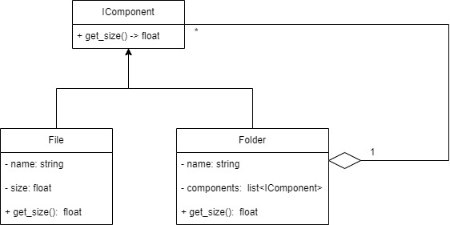

# Composite

O Composite ele tem seguinte diagrama de classes.

Ele é muito utilizado no SOLI**D**, sendo o **D** de Dependence Inversion (Inversão de Dependências).

## Interface

## Model

---

# Refêrencias

- [Desgin Patterns in Python: Composite Pattern](https://python.plainenglish.io/design-patterns-in-python-composite-pattern-2fa89a026564)

- [Composite em Python](https://refactoring.guru/design-patterns/composite/python/example#:~:text=Composite%20is%20a%20structural%20design,require%20building%20a%20tree%20structure.)