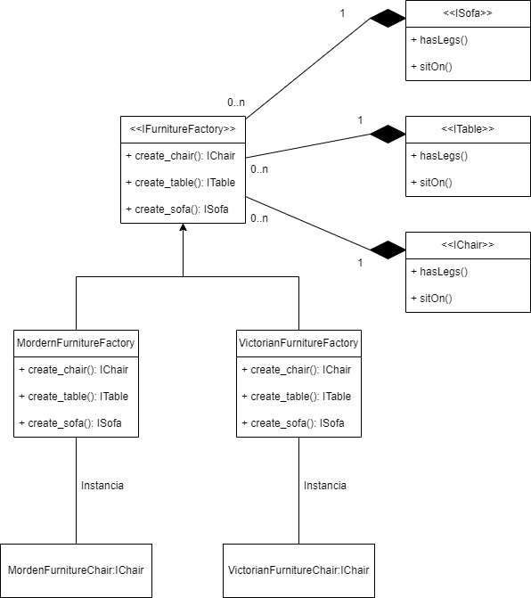

# Abstract Factory

Ela é representada pelo seguinte diagrama de classes:

Nós usamos esse Design Patterns quando queremos criar uma categoria diferente de produtos do mesmo tipo, exemplo um carro, um Jeep Renegade vermelho é diferente de um PT Cruiser Preto, mas no final os dois são carros.

> O Exemplo utilizado é de uma loja de venda de imoveis, esse exemplo está nas referências.

## Controllers

- [MordernFurnitureFactory]()
- [VictorianFurnitureFactory]()

## Interfaces

- [IChair]()
- [IFurnitureFactory]()
- [ISofa]()
- [ITable]()

## Models

- [MordernFurniture]()
- [VictorianFurniture]()

---

# Referência

- [Abstract Factory](https://refactoring.guru/pt-br/design-patterns/abstract-factory)