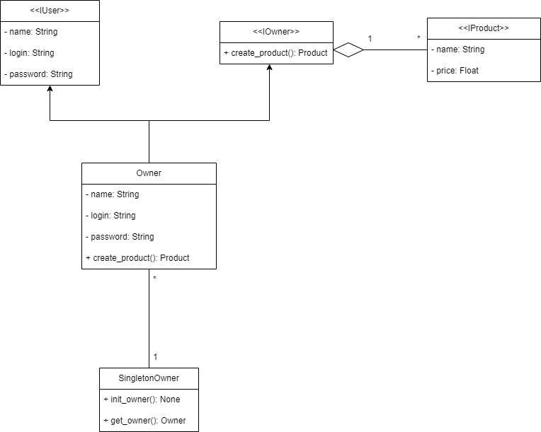

# Singleton

Representado pelo seguinte diagrama de classes:

O Singleton é um Design Patterns que garante que só vai existir uma instancia daquela classe no código inteiro.

> Importante notar que o *Singleton* é considerado um anti-design, pois ele quebra o **S**olid, ou seja a regra de Individualidade única.

## Interfaces

- [IUser](./iuser.md)

- [IOwner](./owner.md)

- [IProduct](./iproduct.md)

## Models

- [Owner](./owner.md)

## Controller

- [SingletonOwner](./singleton_owner.md)

---

# Refêrencias

- [Singleton](https://refactoring.guru/pt-br/design-patterns/singleton)

- GAMMA, E.; HELM, R.; JOHNSON, R.; VLISSIDES, J. Design Patterns: Elements of Reusable Object-Oriented Software. 1. ed. Reading, Massachusetts: Addison-Wesley, 1994.
