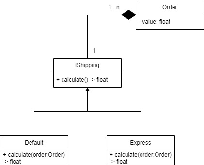

# Strategy

O Strategy tem o seguinte diagrama de classes:

O padrão Strategy serve para “definir uma família de algoritmos, encapsular cada uma delas e torná-las intercambiáveis. Strategy permite que o algoritmo varie independentemente dos clientes que o utilizam” como definido no livro do GoF.

> Estamos exemplicafando Strategy usando um cénario de calculo de frete de uma compra, aonde o envio padrão custa 0.05 do valor da compra e o Express custa 0.1

## Interfaces

- [Shipping](./shipping.md)

## Models

- [Default](./default.md)
- [Express](./express.md)

## Controllers

- [Calculate Shipping](./calculate_shipping.md)

---

# Referências

[Strategy](https://refactoring.guru/design-patterns/strategy)
[Design Patterns com Python: O padrão Strategy](https://medium.com/@hudsonbrendon/design-patterns-com-python-o-padrão-strategy-3cc56f96c05c)